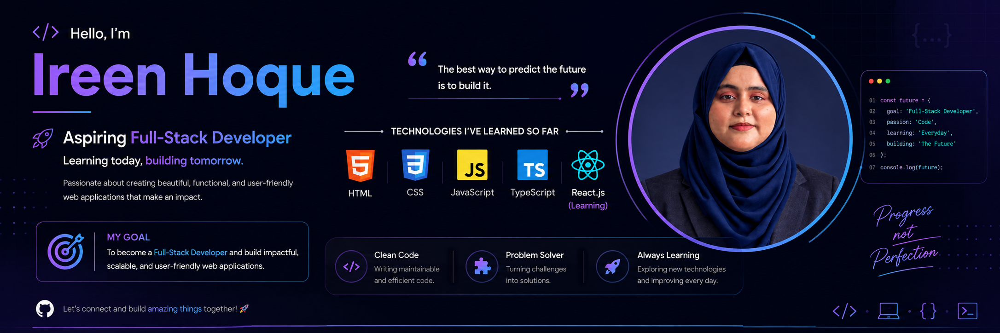

  

<h1 align="center">Hi 👋, I'm Ireen Hoque</h1>
<h3 align="center">An aspiring Full-Stack Developer.</h3>

- 🌱 I’m currently learning **React.js**

- 💬 Ask me about **HTML, CSS, JavaScript, and TypeScript**

- 📫 How to reach me **ireenhoque.ph@gmail.com**

👩‍💻 About Me:
Hi, I'm Ireen Hoque, an aspiring Full-Stack Developer currently on a journey to build a career in web development. I'm from Cumilla, Chattogram Division, Bangladesh.
I recently completed my postgraduate degree in Bangladesh Studies at the University of Chittagong. Although my academic background is different from technology, I discovered an interest in programming and web development and decided to pursue this new career path. I enjoy learning new technologies, solving problems, and challenging myself to improve every day.

🚀 What I'm Currently Doing:
🌱 Currently learning React.js
💻 Building projects to strengthen my frontend development skills
🧠 Practicing JavaScript and TypeScript
🎯 Working toward becoming a Full-Stack Developer
📚 Continuously learning new web development concepts and technologies
⚡ Improving my problem-solving and clean coding skills

<h3 align="left">Connect with me:</h3>

<h3 align="left">Languages and Tools:</h3>

     

&nbsp;

